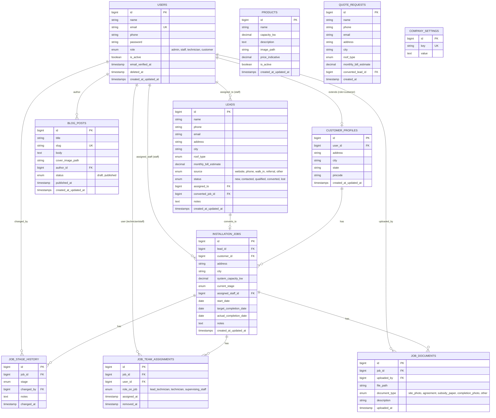

# Database & Entity Document
## Hindustan Vidyut Udyog — Solar Installation Platform

**Version:** 1.0
**Companion to:** [PRD](01-PRD.md) · [UI/UX Screen Document](03-ui-ux-screen-document.md) · [API & Backend Contract Document](04-api-backend-contract.md)

All entity names, enum values, and field names in this document are canonical — the UI and API docs reference them exactly as written here.

---

## 1. Entity-Relationship Diagram

---

## 2. Table Definitions

### 2.1 `users`

Single table for Admin, Staff, Technician, and Customer — differentiated by `role`.

| Column | Type | Constraints | Notes |
|---|---|---|---|
| id | bigint unsigned | PK, auto-increment | |
| name | varchar(255) | not null | |
| email | varchar(255) | unique, not null | login identifier |
| phone | varchar(20) | nullable | |
| password | varchar(255) | not null | hashed |
| role | enum | not null, default `customer` | `admin`, `staff`, `technician`, `customer` |
| is_active | boolean | not null, default true | deactivated users cannot log in |
| email_verified_at | timestamp | nullable | |
| remember_token | varchar(100) | nullable | Laravel default |
| deleted_at | timestamp | nullable | soft deletes |
| created_at, updated_at | timestamp | | |

### 2.2 `customer_profiles`

Extends a `users` row where `role = customer` with address/billing-adjacent info. One-to-one with `users`.

| Column | Type | Constraints | Notes |
|---|---|---|---|
| id | bigint unsigned | PK | |
| user_id | bigint unsigned | FK → users.id, unique, not null | |
| address | varchar(255) | nullable | |
| city | varchar(100) | nullable | |
| state | varchar(100) | nullable | |
| pincode | varchar(10) | nullable | |
| created_at, updated_at | timestamp | | |

### 2.3 `leads`

Public quote requests and manually-entered enquiries.

| Column | Type | Constraints | Notes |
|---|---|---|---|
| id | bigint unsigned | PK | |
| name | varchar(255) | not null | |
| phone | varchar(20) | not null | |
| email | varchar(255) | nullable | |
| address | varchar(255) | nullable | |
| city | varchar(100) | nullable | |
| roof_type | enum | nullable | `rcc`, `tin_shed`, `tiled`, `other` |
| monthly_bill_estimate | decimal(10,2) | nullable | self-reported by lead |
| source | enum | not null, default `website` | `website`, `phone`, `walk_in`, `referral`, `other` |
| status | enum | not null, default `new` | `new`, `contacted`, `qualified`, `converted`, `lost` |
| assigned_to | bigint unsigned | FK → users.id, nullable | staff member owning this lead |
| converted_job_id | bigint unsigned | FK → installation_jobs.id, nullable | set when converted |
| notes | text | nullable | |
| created_at, updated_at | timestamp | | |

**Index:** `status`, `assigned_to`, `created_at`.

### 2.4 `installation_jobs`

The core pipeline entity — one per residential installation.

| Column | Type | Constraints | Notes |
|---|---|---|---|
| id | bigint unsigned | PK | |
| lead_id | bigint unsigned | FK → leads.id, nullable | null if job created directly |
| customer_id | bigint unsigned | FK → users.id, not null | must be a user with role=customer |
| address | varchar(255) | not null | installation site address |
| city | varchar(100) | nullable | |
| system_capacity_kw | decimal(6,2) | nullable | e.g. 3.00, 5.00 |
| current_stage | enum | not null, default `lead` | see canonical stage enum §4 |
| assigned_staff_id | bigint unsigned | FK → users.id, nullable | responsible office/sales staff |
| start_date | date | nullable | |
| target_completion_date | date | nullable | |
| actual_completion_date | date | nullable | set at `handover` |
| notes | text | nullable | |
| created_at, updated_at | timestamp | | |

**Index:** `current_stage`, `customer_id`, `assigned_staff_id`.

### 2.5 `job_stage_history`

Append-only audit log of every stage transition. `installation_jobs.current_stage` is a denormalized "latest" pointer; this table is the source of truth for history.

| Column | Type | Constraints | Notes |
|---|---|---|---|
| id | bigint unsigned | PK | |
| job_id | bigint unsigned | FK → installation_jobs.id, not null | |
| stage | enum | not null | the stage moved *to* |
| changed_by | bigint unsigned | FK → users.id, not null | |
| notes | text | nullable | optional comment on the transition |
| changed_at | timestamp | not null, default now | |

**Index:** `job_id`, `changed_at`.

### 2.6 `job_team_assignments`

Supports multiple technicians (and a supervising staff member) per job.

| Column | Type | Constraints | Notes |
|---|---|---|---|
| id | bigint unsigned | PK | |
| job_id | bigint unsigned | FK → installation_jobs.id, not null | |
| user_id | bigint unsigned | FK → users.id, not null | must be role=technician or staff |
| role_on_job | enum | not null | `lead_technician`, `technician`, `supervising_staff` |
| assigned_at | timestamp | not null, default now | |
| removed_at | timestamp | nullable | set instead of deleting, to preserve history |

**Index:** `job_id`, `user_id`.

### 2.7 `job_documents`

| Column | Type | Constraints | Notes |
|---|---|---|---|
| id | bigint unsigned | PK | |
| job_id | bigint unsigned | FK → installation_jobs.id, not null | |
| uploaded_by | bigint unsigned | FK → users.id, not null | |
| file_path | varchar(255) | not null | path under `storage/app/public` |
| document_type | enum | not null | `site_photo`, `agreement`, `subsidy_paper`, `completion_photo`, `other` |
| description | varchar(255) | nullable | |
| uploaded_at | timestamp | not null, default now | |

**Index:** `job_id`, `document_type`.

### 2.8 `products`

Panel/system offerings shown on the public Products page.

| Column | Type | Constraints | Notes |
|---|---|---|---|
| id | bigint unsigned | PK | |
| name | varchar(255) | not null | e.g. "5kW Residential System" |
| capacity_kw | decimal(6,2) | not null | |
| description | text | nullable | |
| image_path | varchar(255) | nullable | |
| price_indicative | decimal(10,2) | nullable | "starting from" pricing, not a quote |
| is_active | boolean | not null, default true | |
| created_at, updated_at | timestamp | | |

### 2.9 `blog_posts`

| Column | Type | Constraints | Notes |
|---|---|---|---|
| id | bigint unsigned | PK | |
| title | varchar(255) | not null | |
| slug | varchar(255) | unique, not null | |
| body | longtext | not null | |
| cover_image_path | varchar(255) | nullable | |
| author_id | bigint unsigned | FK → users.id, not null | |
| status | enum | not null, default `draft` | `draft`, `published` |
| published_at | timestamp | nullable | |
| created_at, updated_at | timestamp | | |

### 2.10 `quote_requests`

Raw public-form submissions. Kept separate from `leads` so every raw submission is preserved even if duplicate/spam; a valid submission is immediately mirrored into `leads` (see conversion flow below).

| Column | Type | Constraints | Notes |
|---|---|---|---|
| id | bigint unsigned | PK | |
| name | varchar(255) | not null | |
| phone | varchar(20) | not null | |
| email | varchar(255) | nullable | |
| address | varchar(255) | nullable | |
| city | varchar(100) | nullable | |
| roof_type | enum | nullable | same values as `leads.roof_type` |
| monthly_bill_estimate | decimal(10,2) | nullable | |
| converted_lead_id | bigint unsigned | FK → leads.id, nullable | |
| created_at | timestamp | | no updated_at — immutable record |

**Conversion flow:** `POST /quote-request` (public) → inserts `quote_requests` row → immediately creates a matching `leads` row (`source = website`, `status = new`) → sets `quote_requests.converted_lead_id`. Staff only ever work from `leads`; `quote_requests` is a raw-intake audit table.

### 2.11 `company_settings`

Simple key-value store for site-wide config (contact info, social links, SEO defaults) editable from the admin Settings screen.

| Column | Type | Constraints | Notes |
|---|---|---|---|
| id | bigint unsigned | PK | |
| key | varchar(100) | unique, not null | e.g. `contact_phone`, `contact_email`, `address`, `facebook_url`, `seo_default_title` |
| value | text | nullable | |

### 2.12 Laravel framework tables (standard, not custom-designed)

Required by the chosen stack; created by Laravel's own migrations, not hand-designed here:

- `password_reset_tokens`, `sessions` — auth scaffolding (Breeze).
- `jobs`, `job_batches`, `failed_jobs` — required by the `database` queue driver (NFR-4 in PRD).
- `cache`, `cache_locks` — if using the `database` cache driver (shared-hosting friendly alternative to Redis).

---

## 3. Relationships (narrative)

- **User → Customer Profile:** one-to-one, only for users with `role = customer`.
- **Lead → Installation Job:** one-to-zero-or-one. A lead is converted at most once (`leads.converted_job_id`); `installation_jobs.lead_id` is nullable for jobs created directly by staff without a prior lead.
- **Customer (User) → Installation Jobs:** one-to-many. Rare but supported (e.g. a repeat customer adding a second system, or a referral tracked under the same account).
- **Installation Job → Stage History:** one-to-many, append-only. `installation_jobs.current_stage` always equals the `stage` of the most recent `job_stage_history` row for that job (kept in sync on every stage-change action, not independently editable).
- **Installation Job → Team Assignments:** one-to-many. A job can have several technicians plus one supervising staff member active at once (rows with `removed_at IS NULL`).
- **Installation Job → Documents:** one-to-many.
- **Blog Post / Job Document / Job Stage History → User:** each records who performed the action (`author_id`, `uploaded_by`, `changed_by`) for auditability (NFR-7 in PRD).

---

## 4. Canonical Enum Values

These exact strings are used identically in the database, UI, and API — do not introduce synonyms.

**`role` (users):** `admin`, `staff`, `technician`, `customer`

**`current_stage` / `job_stage_history.stage` (ordered pipeline):**
1. `lead`
2. `site_survey`
3. `quotation`
4. `agreement`
5. `installation`
6. `inspection`
7. `handover`

**`lead.status`:** `new`, `contacted`, `qualified`, `converted`, `lost`

**`lead.source`:** `website`, `phone`, `walk_in`, `referral`, `other`

**`roof_type`:** `rcc`, `tin_shed`, `tiled`, `other`

**`job_team_assignments.role_on_job`:** `lead_technician`, `technician`, `supervising_staff`

**`job_documents.document_type`:** `site_photo`, `agreement`, `subsidy_paper`, `completion_photo`, `other`

**`blog_posts.status`:** `draft`, `published`

---

## 5. Indexing Notes

- All foreign key columns are indexed by default via Laravel's `foreignId()->constrained()`.
- `leads.status`, `installation_jobs.current_stage` — indexed; these are the primary filter columns on their respective list screens.
- `blog_posts.slug`, `users.email` — unique indexes (lookup + integrity).
- `job_stage_history(job_id, changed_at)` — composite index to efficiently render a job's timeline in order.
- `job_team_assignments(job_id, removed_at)` — to efficiently fetch "currently active" assignments per job.
