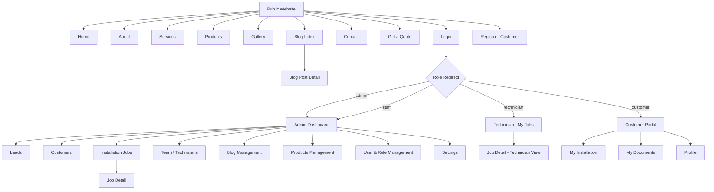

# UI / UX Screen Document
## Hindustan Vidyut Udyog — Solar Installation Platform

**Version:** 1.0
**Companion to:** [PRD](01-PRD.md) · [Database & Entity Document](02-database-entity-document.md) · [API & Backend Contract Document](04-api-backend-contract.md)

Stack assumption: Blade + Tailwind CSS + Livewire. Screen names, roles, and stage names match the PRD and Database docs exactly.

---

## 1. Site Map



---

## 2. Public Website Screens

### 2.1 Home
- **Purpose:** First impression, drive to quote form.
- **Elements:** Hero with CTA ("Get a Free Quote"), services summary, why-choose-us, featured products (from `products` where `is_active`), testimonials, recent blog posts, footer with contact info.
- **Access:** Public.

### 2.2 About
- **Purpose:** Build trust — company background, experience, certifications.
- **Elements:** Static content blocks, team/founder note (optional), CTA banner.

### 2.3 Services
- **Purpose:** Explain the residential installation process.
- **Elements:** Step-by-step visual of the pipeline stages (Lead → Site Survey → Quotation → Agreement → Installation → Inspection → Handover) presented in customer-friendly language, FAQ accordion.

### 2.4 Products
- **Purpose:** Show panel/system capacity options.
- **Elements:** Grid of product cards (name, capacity_kw, image, indicative price, short description) sourced from `products`. Each card CTA → Get a Quote (pre-fills interest).

### 2.5 Gallery
- **Purpose:** Social proof via completed installation photos.
- **Elements:** Image grid/lightbox, optionally grouped by product/capacity.

### 2.6 Blog Index / Blog Post Detail
- **Purpose:** SEO + education (subsidies, savings, schemes).
- **Elements:** Index — paginated list of `blog_posts` where `status = published`, ordered by `published_at`. Detail — title, cover image, body, author, related posts.

### 2.7 Contact
- **Purpose:** Alternative contact channel.
- **Elements:** Address/phone/email (from `company_settings`), embedded map, simple contact form.

### 2.8 Get a Quote
- **Purpose:** Primary lead-capture conversion point.
- **Fields:** Name, phone, email (optional), address, city, roof type (select), approximate monthly electricity bill.
- **Behavior:** Submits to `POST /quote-request` (public, no login). On success, shows a confirmation message ("We'll contact you within 24 hours"). Rate-limited to deter spam.
- **Wireframe sketch:**
```
┌─────────────────────────────────────┐
│  Get a Free Solar Quote              │
├─────────────────────────────────────┤
│  Name        [______________]        │
│  Phone       [______________]        │
│  Email       [______________]        │
│  Address     [______________]        │
│  City        [______________]        │
│  Roof Type   [ RCC ▾ ]                │
│  Monthly Bill (approx) [____] ₹      │
│                                       │
│           [ Request My Quote ]        │
└─────────────────────────────────────┘
```

### 2.9 Login / Register
- **Login:** Single form for all roles; on success, server redirects by `role` (see site map).
- **Register:** Customer self-registration only. Staff/Technician/Admin accounts are provisioned by Admin — no "role" selector on this form.

---

## 3. Admin Panel Screens

Sidebar navigation and screen visibility differ by role — see §6 Navigation Matrix.

### 3.1 Dashboard
- **Purpose:** At-a-glance operational status.
- **Elements:** KPI cards (New Leads this month, Active Jobs by stage as a small bar/count list, Upcoming Installations in next 7 days, Recently Completed). Recent activity feed (latest stage changes, latest leads).
- **Visible to:** Admin, Staff (full); Technician sees a reduced "My Jobs" view instead (§4).
- **Sketch:**
```
┌───────────────────────────────────────────────────┐
│ Dashboard                                           │
├───────────────┬───────────────┬───────────────────┤
│ New Leads      │ Active Jobs    │ Upcoming (7 days)  │
│    12          │     34         │       5            │
├───────────────┴───────────────┴───────────────────┤
│ Jobs by Stage                                        │
│ Lead ██ 4  Survey ███ 6  Quote ██ 3  Agreement █ 2   │
│ Install ████ 8  Inspection ██ 3  Handover █████ 8    │
├───────────────────────────────────────────────────┤
│ Recent Activity                                      │
│ • Job #204 moved to Installation — 2h ago            │
│ • New lead: Rakesh Sharma — 3h ago                    │
└───────────────────────────────────────────────────┘
```

### 3.2 Leads — List
- **Purpose:** Triage and manage incoming enquiries.
- **Elements:** Table (Name, Phone, City, Source, Status, Assigned To, Created), filters (status, source, assigned staff, date range), search, "Add Lead" button (manual entry), row click → detail.
- **Sketch:**
```
┌──────────────────────────────────────────────────────────┐
│ Leads                                    [+ Add Lead]      │
│ Filter: [Status ▾] [Source ▾] [Assigned ▾] [Search____]   │
├────────────┬─────────┬────────┬─────────┬────────┬───────┤
│ Name        │ Phone    │ City   │ Source  │ Status │ Owner │
├────────────┼─────────┼────────┼─────────┼────────┼───────┤
│ Rakesh S.   │ 98xxxxx  │ Pune   │ Website │ New    │ —     │
│ Anita P.    │ 97xxxxx  │ Pune   │ Phone   │ Qualified │ Ravi│
└──────────────────────────────────────────────────────────┘
```

### 3.3 Lead Detail
- **Purpose:** Work a single lead through to conversion.
- **Elements:** Contact info, roof type/bill estimate, status dropdown, assign-to-staff dropdown, notes/activity log, **"Convert to Installation Job"** primary action (creates `installation_jobs` row + customer account if needed).

### 3.4 Customers — List / Detail
- **List:** Table (Name, Phone, City, Active Jobs count), search.
- **Detail:** Contact info (editable by staff/admin), linked installation jobs (with current stage badge), all documents across their jobs.

### 3.5 Installation Jobs — List
- **Purpose:** Pipeline-wide visibility.
- **Elements:** Table or kanban-style board grouped by `current_stage` (Lead, Site Survey, Quotation, Agreement, Installation, Inspection, Handover), filters (stage, assigned technician, date range), search by customer name/address.
- **Sketch (kanban view):**
```
┌────────┬──────────────┬───────────┬───────────┬──────────────┬────────────┬──────────┐
│ Lead   │ Site Survey   │ Quotation │ Agreement │ Installation │ Inspection │ Handover │
├────────┼──────────────┼───────────┼───────────┼──────────────┼────────────┼──────────┤
│ Job#209│ Job#204        │ Job#198   │ Job#190   │ Job#187       │ Job#180     │ Job#175  │
│ Job#211│                │           │           │ Job#188       │             │ Job#176  │
└────────┴──────────────┴───────────┴───────────┴──────────────┴────────────┴──────────┘
```

### 3.6 Installation Job — Detail
- **Purpose:** Single source of truth for one installation.
- **Elements:**
  - Header: customer name, address, system capacity, current stage badge.
  - **Stage timeline** — visual horizontal/vertical stepper of all 7 stages, showing completed (with date + who), current (highlighted), and pending stages.
  - **Advance Stage** action (Livewire component `JobPipelineBoard` / stage-update control) — moves to next stage, requires optional note, writes to `job_stage_history`.
  - **Team** panel — assigned technician(s) and supervising staff, with an "Assign" control (Admin/Staff only).
  - **Documents** panel — grouped by `document_type`, upload control (drag-drop or file picker), thumbnail previews for images.
  - **Notes** — free-text internal notes.
- **Sketch:**
```
┌──────────────────────────────────────────────────────────┐
│ Job #204 — Rakesh Sharma — 5kW — [Installation]            │
├──────────────────────────────────────────────────────────┤
│ ●Lead ●Survey ●Quotation ●Agreement ◉Installation ○Inspect ○Handover │
│                                          [Advance Stage ▸]  │
├───────────────────────┬──────────────────────────────────┤
│ Team                   │ Documents                         │
│ • Ravi Kumar (Tech)     │ [Upload]                          │
│ • Suresh (Supervisor)   │ 🖼 site_photo.jpg  📄 agreement.pdf │
└───────────────────────┴──────────────────────────────────┘
```

### 3.7 Team / Technicians
- **Purpose:** Roster and workload visibility.
- **Elements:** Table (Name, Role, Active Job Count, Status), click → their assigned jobs. Assign-to-job happens from the Job Detail screen, not here.

### 3.8 Blog Management — List / Editor
- **List:** Table (Title, Status, Author, Published Date), filter by status.
- **Editor:** Title, slug (auto-generated, editable), rich text/body, cover image upload, status (draft/published), publish date.

### 3.9 Products Management — List / Editor
- **List:** Table (Name, Capacity, Active toggle).
- **Editor:** Name, capacity_kw, description, image upload, indicative price, active toggle.

### 3.10 User & Role Management (Admin only)
- **Purpose:** Provision and manage staff/technician/customer accounts.
- **Elements:** Table (Name, Email, Role, Status), Add User (name, email, role, temp password/invite), deactivate toggle.

### 3.11 Settings
- **Purpose:** Site-wide config.
- **Elements:** Company contact info, address, social links, SEO defaults — maps to `company_settings` key-value pairs.

---

## 4. Technician View

A deliberately reduced subset of the admin panel — same underlying Job Detail component, restricted by policy (see API doc §5 Authorization Matrix).

### 4.1 My Jobs
- **Purpose:** Focused list for a field technician.
- **Elements:** Card/list of jobs where the technician is in `job_team_assignments` with `removed_at IS NULL`, showing address, current stage, customer name/phone (tap to call).
- **No access to:** Leads, Customers list, other technicians' jobs, Blog, Products, Settings, User Management.

### 4.2 Job Detail (Technician View)
- Same stage timeline and Documents upload as Admin's Job Detail, but:
  - Can advance stage only for stages the technician is authorized to move (typically Installation → Inspection).
  - Cannot edit team assignment, cannot see internal notes marked staff-only (if such a distinction is used), cannot delete documents.

---

## 5. Customer Portal Screens

### 5.1 My Installation
- **Purpose:** Self-service status check — the single most valuable customer-facing screen.
- **Elements:** Read-only stage timeline (same visual language as admin's, simplified copy: "Your system is currently being installed"), assigned technician's name, target completion date.
- **Sketch:**
```
┌──────────────────────────────────────────────────────────┐
│ Your Installation                                          │
├──────────────────────────────────────────────────────────┤
│ ✓ Lead   ✓ Site Survey   ✓ Quotation   ✓ Agreement          │
│ ◉ Installation (in progress)   ○ Inspection   ○ Handover     │
│                                                              │
│ Technician: Ravi Kumar                                      │
│ Target Completion: 15 Aug 2026                              │
└──────────────────────────────────────────────────────────┘
```

### 5.2 My Documents
- **Purpose:** View documents shared with them (agreement copy, completion photos).
- **Elements:** List/grid grouped by `document_type`, download/view only — no delete.

### 5.3 Profile
- **Purpose:** Manage own account.
- **Elements:** Name, phone, address (editable), email (read-only or verified-change), change password.

---

## 6. Navigation Matrix (sidebar items per role)

| Nav item | Admin | Staff | Technician | Customer |
|---|:---:|:---:|:---:|:---:|
| Dashboard | ✅ | ✅ | — (My Jobs instead) | — |
| Leads | ✅ | ✅ | ❌ | ❌ |
| Customers | ✅ | ✅ | ❌ | ❌ |
| Installation Jobs | ✅ (all) | ✅ (all) | ✅ (own only, as "My Jobs") | ❌ |
| Team / Technicians | ✅ | ✅ | ❌ | ❌ |
| Blog Management | ✅ | ✅ | ❌ | ❌ |
| Products Management | ✅ | ✅ | ❌ | ❌ |
| User & Role Management | ✅ | ❌ | ❌ | ❌ |
| Settings | ✅ | ❌ | ❌ | ❌ |
| My Installation | ❌ | ❌ | ❌ | ✅ |
| My Documents | ❌ | ❌ | ❌ | ✅ |
| Profile | ✅ | ✅ | ✅ | ✅ |

---

## 7. Responsive Behavior

- **Public site:** Mobile-first; sticky "Get a Quote" CTA button on mobile scroll for Home/Services/Products.
- **Admin sidebar:** Collapses to a hamburger-triggered off-canvas drawer below `md` breakpoint.
- **Tables → cards:** All admin list tables (Leads, Customers, Jobs) switch to stacked card layout below `md`, since technicians and staff may check the panel on tablets/phones in the field.
- **Job Detail stage timeline:** Horizontal stepper on desktop, vertical stepper on mobile.
- **Document upload:** Native file picker on mobile (enables camera capture directly for site/completion photos).
